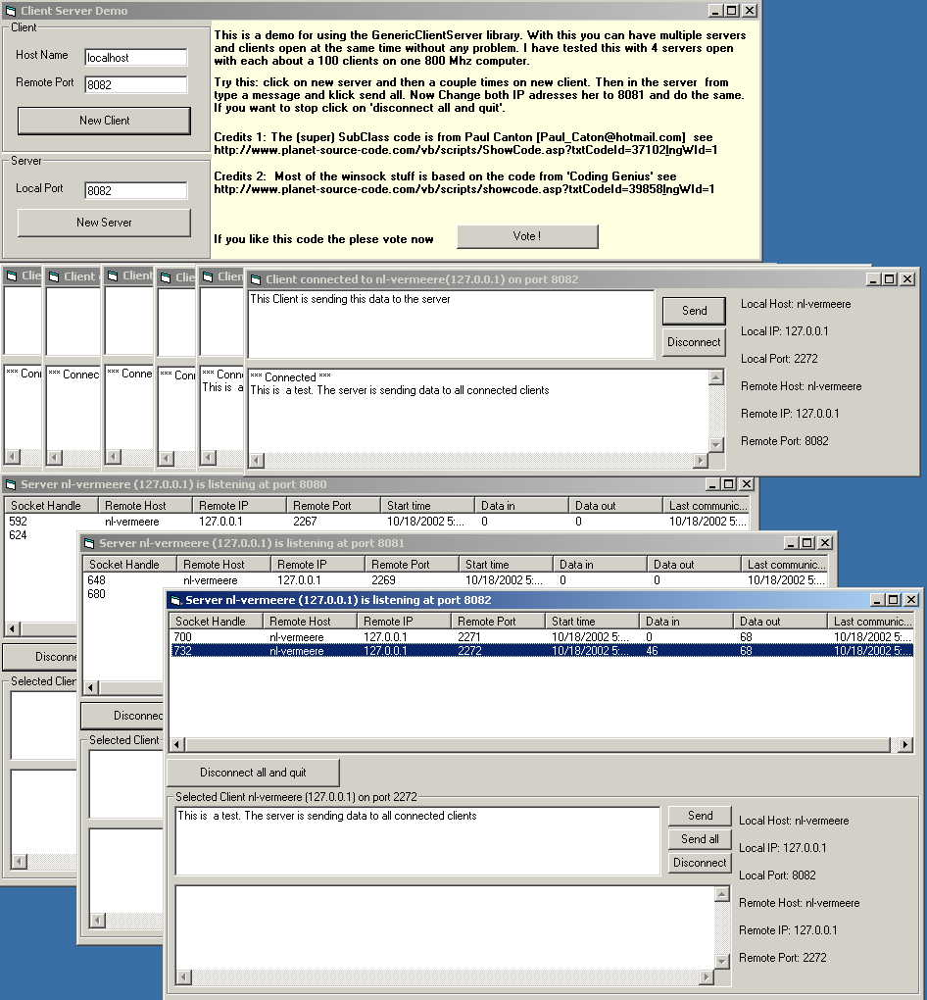



## Generic Client and Server \(Winsock API only, multiple instances, subclassing\) \_\_\_\_\_ updated oct 21

### Description

New version with bug fixes and improvements can be found at:

http://www.planet-source-code.com/vb/scripts/ShowCode.asp?txtCodeId=44590&lngWId=1

With this it is easy to run multiple instances of a client or server. It is an API only winsock wrapper setup as an active X dll. There is also a sample application from where you can open multiple servers and clients which can communicate which each other.

This code will also show you how to Subclass without a form. (actually the form is generated by code)

Updated on Oct 21 : Cleaned up the code (variable names, removed unused code, added remarks) and fixed some minor bug's.
 
### More Info
 

             |
---                |---
**Submitted On**   |2002-10-21 15:02:36
**By**             |[Edwin Vermeer\.](https://github.com/Planet-Source-Code/PSCIndex/blob/master/ByAuthor/edwin-vermeer.md)
**Level**          |Intermediate
**User Rating**    |4.7 (80 globes from 17 users)
**Compatibility**  |VB 6\.0
**Category**       |[Internet/ HTML](https://github.com/Planet-Source-Code/PSCIndex/blob/master/ByCategory/internet-html__1-34.md)
**World**          |[Visual Basic](https://github.com/Planet-Source-Code/PSCIndex/blob/master/ByWorld/visual-basic.md)
**Archive File**   |[Generic\_Cl14847710212002\.zip](https://github.com/Planet-Source-Code/edwin-vermeer-generic-client-and-server-winsock-api-only-multiple-instances-subclassing-up__1-39939/archive/master.zip)

